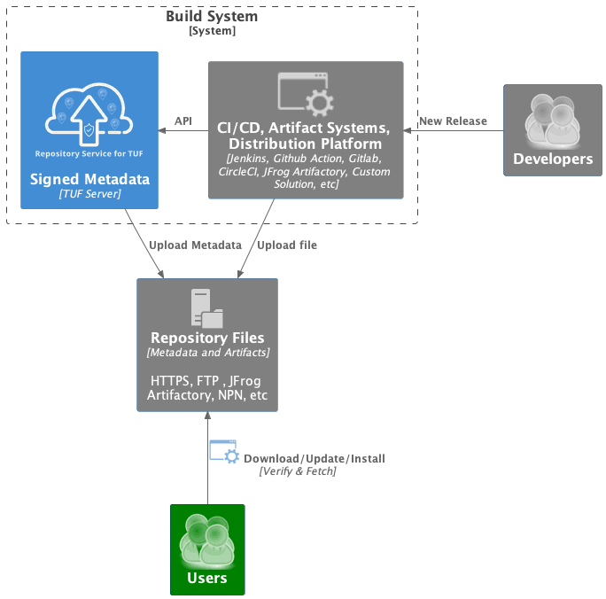

Repository Service for TUF (RSTUF)
==================================

.. note::

    Repository Service for TUF is a *work in progress*.

    RSTUF is currently (November 2022) considered **experimental**, use with
    caution.

    See our `ROADMAP`_ to understand when this disclaimer may be removed.

Repository Service for TUF (RSTUF) is a system for securing content downloads
from tampering between the repository and the client (for example, by an
on-path attacker).

RSTUF is designed to be integrated with existing content delivery solutions --
at the edge or in public/private clouds -- alongside current artifact
production systems, such as build systems, including; Jenkins, GitHub Actions,
GitLab, CircleCI, etc. RSTUF protects downloading, installing, and updating
content from arbitrary content repositories, such as a web server, JFrog
Artifactory, GitHub packages, etc.

RSTUF security properties are achieved through implementing
`The Update Framework <https://theupdateframework.io/>`_ (TUF) as a service.

RSTUF simplifies adoption of TUF by removing the need to design a repository
integration -- RSTUF encapsulates that design.

Integrating RSTUF into your existing content delivery solutions is simple
thanks to the REST API. Furthermore, RSTUF is designed for scalability and can
support very active repositories with multiple repository workers.

At present, RSTUF implements a streamlined variant of the Python Package Index
(PyPI)'s `PEP 458 – Secure PyPI downloads with signed repository metadata
<https://peps.python.org/pep-0458/>`_. In future, RSTUF will grow to provide
additional protections through supporting end-to-end signing of packages,
comparable to PyPI's `PEP 480 – Surviving a Compromise of PyPI: End-to-end
signing of packages <https://peps.python.org/pep-0480/>`_.

Questions, feedback, and suggestions are welcomed on the
`#repository-service-for-tuf <https://cloud-native.slack.com/archives/C047L55314N>`_
channel on `CNCF Slack <https://slack.cncf.io/>`_.

How does Repository Service for TUF compare to other solutions?

`Rugged <https://rugged.works>`_: Repository Service for TUF is a collection
of services to deploy a scalable and distributed TUF Repository. RSTUF
provides an easy interface to integrate (the REST API) and a tool for
managing the Metadata Repository (CLI).

`PyPI/PEP 458 <https://peps.python.org/pep-0458/>`_: Repository Service for
TUF is a generalization of the design in PEP 458 that can be integrated into
a variety of content repository architectures.

.. rstuf-image-high-level

Using
=====

Please, check the `Repository Service for TUF Guide
<https://repository-service-tuf.readthedocs.io/en/latest/guide/introduction/introduction.html>`_
for the deployment instructions and more details.

Contributing
============

This git repository contains high-level documentation guides and component
integrations.

Check our `CONTRIBUTING.rst <CONTRIBUTING.rst>`_ for more details on how to
contribute.

Please, check the `Repository Service for TUF Development Guide
<https://repository-service-tuf.readthedocs.org/devel>`_.

.. _ROADMAP: ROADMAP.rst
