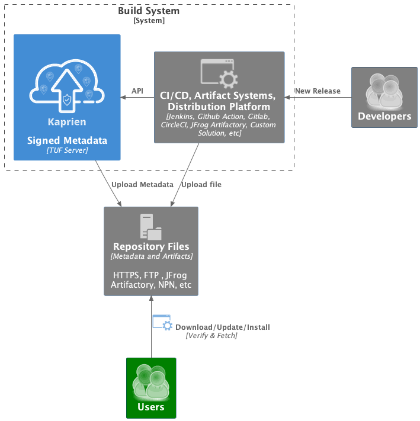

Kaprien
=======

.. note::

    The Kaprien is a tool still under development and is not ready for production.

What is Kaprien?
================

Kaprien implements a Server with a signed Metadata Repository using `The Update
Framework <http://theupdateframework.io/>`_ (TUF) as a Service.

Kaprien can be deployed and used in the edge or public/private cloud along
build systems (i.e., Jenkins, GitHub Actions, GitLab, CircleCI, etc.).
It protects users downloading, installing, and updating from your artifact
repository (web server, JFrog Artifactory, Github Packages, etc.)

Kaprien provides a REST API Service to integrate your release flows and
architecture to scale efficiently. Deploying and integrating into your release
flows is easy using the REST API Service.

.. kaprien-image-high-level

Using
=====

Please, check the `Kaprien Guide
<https://kaprien.readthedocs.org/guide/overview/overview.html>`_  for the
Installations and more details.

Development/Contributing
========================

Please, check the `Kaprien Development <https://kaprien.readthedocs.org/devel>`_.

