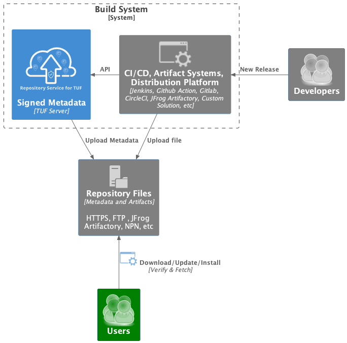

Repository Service for TUF
==========================

.. note::

    The Repository Service for TUF is a tool still under development and is not
    ready for production.

Repository Service for TUF (RSTUF) is a system for securing software downloads
with signed repository metadata that helps clients be sure they are retrieving
the latest version of content published by the repository and that the content
has not been tampered with between the repository and the client (for example,
by an on-path attacker). This protects users from downloading, installing, and
updating content from an artifact repository, such as a web server, JFrog
Artifactory, GitHub packages, etc.

RSTUF implements a Repository Server with a signed Metadata Repository using
`The Update Framework <http://theupdateframework.io/>`_ (TUF) as a Service.
It is designed to be deployed as part of an existing content delivery solution
and can be deployed and used in the edge or public/private cloud alongside
artifact production systems (i.e., build systems including Jenkins, GitHub
Actions, GitLab, CircleCI, etc.).

RSTUF provides a REST API to integrate your release flows and architecture to
scale efficiently. Deploying and integrating into your release flows is easy
using the REST API Service.

Repository Service for TUF compared to other solutions:

Rugged: Repository Service for TUF is a collection of services to deploy
scalable and distributed TUF Repository. It also provides an easy interface to
integrate (through Rest API) and a tool for managing the Metadata Repository.

PyPI/PEP 458: Repository Service for TUF is a generalization of the design in
PEP 458 that can be integrated into a variety of content repository
architectures.

.. rstuf-image-high-level

Using
=====

Please, check the `Repository Service for TUF Guide
<https://docs.kaprien.com/guide/overview/overview.html>`_  for the
Installations and more details.

Contributing
============

This git repository contains high-level documentation guides and component
integrations.

Check our `CONTRIBUTIG.rst <CONTRIBUTIG.rst>`_ for more details on how to
contribute.

Please, check the `Repository Service for TUF Development
<https://docs.kaprien.com/devel>`_.

