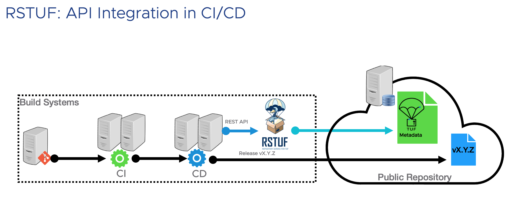
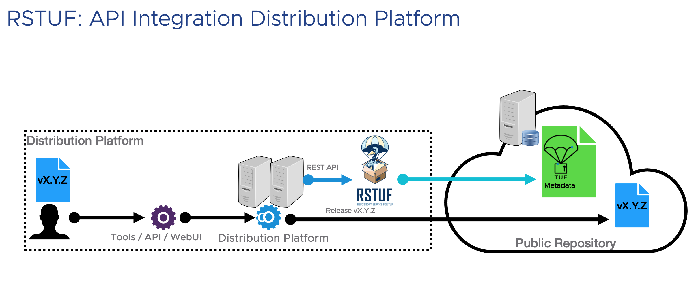

========================================
Repository Service for TUF Documentation
========================================

.. note::

    Repository Service for TUF is a work in progress. As of June 2023 RSTUF is
    considered **beta** - use with caution.

    Please reference the The RSTUF `ROADMAP`_ for feature and functionality plans.

.. include:: ../../README.rst
  :start-after: .. readme-logo
  :end-before: .. readme-design

.. raw:: html

  

      <iframe src="https://www.youtube.com/embed/IAZO5_rlypI" frameborder="0" allowfullscreen style="position: absolute; top: 0; left: 0; width: 100%; height: 100%;"></iframe>
  

TUF is easily implemented on the client side utilizing powerful TUF client libraries.

Use cases
---------

Some RSTUF use case examples include but are not limited to:

* An organization has a live "Software Updater". This "Software Updater" uses
  TUF to download, install and update software artifacts.
* An organization distributes documents. The reader uses TUF to fetch
  documents submitted by a trusted source.
* An organization owns a private container image registry and uses TUF in the
  CI/CD to deploy computing trusted images at the edge .
* An organization with many Operational Technology (OT) devices in different
  plants uses TUF clients to fetch firmware, software, and projects from a
  distributed artifact repository.
* Web portal, which uses TUF to list all artifacts from a content repository
  and render as a Web UI, the user to download using a web browser.

What is TUF?
============

  *The Update Framework is a software framework designed to protect mechanisms
  that automatically identify and download updates to software. TUF uses a series
  of roles and keys to provide a means to retain security, even when some keys or
  servers are compromised.* [#]_ TUF_

Design/Solution
===============

.. include:: ../../README.rst
  :start-after: .. readme-design-intro
  :end-before: .. readme-design-pic-1

.. include:: ../../README.rst
  :start-after: .. readme-design-middle
  :end-before: .. readme-design-pic-2

.. include:: ../../README.rst
  :start-after: .. readme-design-final
  :end-before: .. readme-other-solutions-comparison

Talks, Posts and Mentions about RSTUF
-------------------------------------

Talks
=====

* Open Source Summit 2024: Securing Content Distribution with RSTUF, an Incubating OpenSSF Project
  by Kairo De Araujo and & Martin Vrachev (recording coming soon).
* KubeCon 2024: `Operating a Production TUF Repository <https://youtu.be/WB83-RhMl18?si=H7Yq8ZFlD8JLt8Y2>`_
  by Kairo de Araujo and Fredrik Skogman.
* `PackagingCon 2023 <https://cfp.packaging-con.org/2023/talk/997FQK/>`_:
  `“Our stuff” - how to protect users from package compromise with RSTUF <https://www.youtube.com/live/mYzqeS2d96A?si=cqQUH5J5wDPrOQFb&t=3801>`_.
* `EuroPython 2023 <https://ep2023.europython.eu/session/pep-458-a-solution-not-only-for-pypi>`_:
  `"PEP 458 a solution not only for PyPI" (video recoding) <https://www.youtube.com/watch?v=8pnOpfvhT9o>`_.

Posts
=====

* `"Introducing RSTUF, Repository Service for TUF" <https://openssf.org/blog/2023/08/31/introducing-rstuf-repository-service-for-tuf/>`_
  by OpenSSF.
* `"Introducing RSTUF beta release" <https://blogs.vmware.com/opensource/2023/07/19/introducing-rstuf-beta-release/>`_
  by VMware.

Mentions
========

* `"Open Source Summit EU 2023: at OpenSSF day Omkhar Arasaratnam, OpenSSF General Manager, mentions
  Repository Service for TUF" <https://youtu.be/WWY6SWaYhxI?si=bT34fgeQquWWh8ga>`_.

* KubeCon 2023: `"Maintaining TUF, a Talk" <https://www.youtube.com/watch?v=1rM8a9cPo-I>`_
  by Joshua Lock and Lukas Pühringer.

  - `RSTUF part start at 23:41 <https://youtu.be/1rM8a9cPo-I?si=aSFHqTpGvs_YUWp0&t=1421>`_.

* KubeCon 2023: `CNCF Graduated Project Updates, TUF mentions the RSTUF Project <https://youtu.be/yit0zu8g_O4?si=jgdhCbMVlLK1EBMa&t=363>`_.

* Open Source Summit NA 2023 : `Toto-Ally TUF: Simple Tools for a Secure Software Supply Chain <https://www.youtube.com/watch?v=O8zs4NnSR5w>`_
  by Marina Moore & Aditya Sirish A Yelgundhalli

  - `The demo uses RSTUF deployed as mentioned here <https://youtu.be/O8zs4NnSR5w?si=dWvk8SwL-fhVT7y7&t=740>`_.

Background and motivation
=========================

`TUF`_ provides a flexible framework and specification that developers can
adopt and an excellent Python Library (`python-tuf`_) that provides two APIs
for low-level Metadata management and client implementation.

Implementing `TUF`_ requires sufficient knowledge of `TUF`_ to design how to
integrate the framework into a repository and hours of engineering work to
implement.

RSTUF was born as a consequence of working on implementing `PEP 458
<https://peps.python.org/pep-0458/>`_ in the `Warehouse`_ project,
*which powers the* [#]_ `Python Package Index (PyPI) <https://pypi.org>`_.

Due to combined experience with the complexity and fragility of deep integration
into an intricate platform, the designing of how to implement a flexible,
reusable TUF platform to integrate into different flows and infrastructures began.

Repository Service for TUF aims to be an easy-to-use tool for Developers,
DevOps, and DevOpsSec teams working on the delivery process.

.. _TUF: https://theupdateframework.io
.. _python-tuf: https://pypi.org/project/tuf/

How to get involved
===================

.. include:: ../../CONTRIBUTING.rst
  :start-after: .. slack-meetings-mail
  :end-before: .. dco

Documentation List
==================

.. toctree::
   :maxdepth: 1

   guide/index
   devel/index

.. _TUF: https://theupdateframework.io
.. _python-tuf: https://pypi.org/project/tuf/
.. _ROADMAP: devel/roadmap.html
.. _Redis: https://redis.io
.. _Warehouse: https://github.com/pypi/warehouse/#warehouse

.. [#] `Wikipedia <https://en.wikipedia.org/wiki/The_Update_Framework>`_
.. [#] Warehouse_
